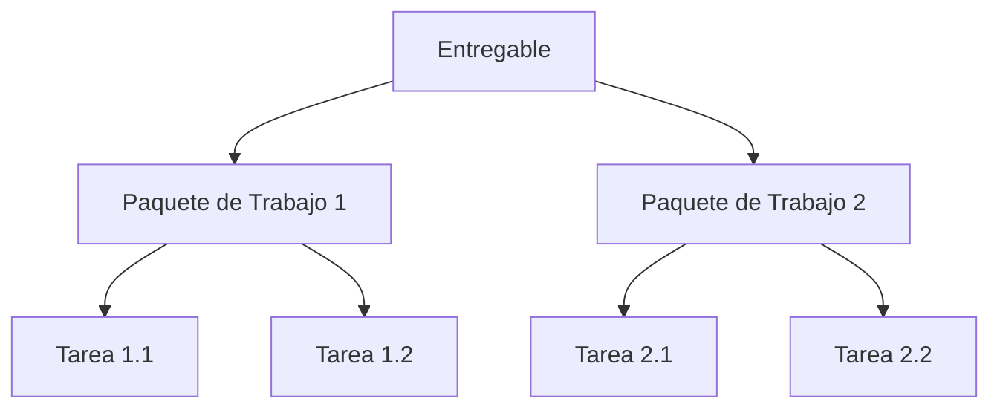

# Descomposicion de Tareas y Generador de Backlog — PM@Siemens

**Proposito**: Descomponer un entregable, objetivo o paquete de trabajo de alto nivel en tareas de backlog accionables alineadas con el modelo de milestones PM@Siemens. La salida se integra directamente con `planning/backlog.md`.

**Alcance**: Descomposicion WBS, preparacion de milestones, integracion de nuevo alcance y reestructuracion de backlog.

---

## Invocacion

```
Follow instructions in #prompt:task-breakdown.prompt.md with these arguments:
  --input "[Descripcion del entregable, objetivo o paquete de trabajo de alto nivel]"
  --target-milestone [PM040|PM100|PM200|PM600|PM700]
  --prioritization [value-effort|must-should-could|criticality]
  --project-folder @workspace
```

**Parametros**:
- `--input`: Descripcion del entregable u objetivo a descomponer (texto libre o referencia a fichero)
- `--target-milestone`: Milestone PM@Siemens al que contribuye este trabajo
- `--prioritization`: Metodo para ordenar tareas — `value-effort` (impacto vs coste), `must-should-could` (niveles de prioridad), `criticality` (ruta critica primero)
- `--project-folder`: Referencia al workspace para lecturas de contexto

---

## Pasos de Procesamiento

### Paso 1: Lecturas de Contexto
Antes de la descomposicion, **siempre leer y cruzar**:
1. `context/OBJECTIVES.md` — Mapear tareas a entradas OBJ-XX especificas
2. `context/SOLUTION-OVERVIEW.md` — Entender el enfoque tecnico/de entrega
3. `context/STAKEHOLDERS.md` — Identificar responsables de tareas por area de competencia
4. `planning/backlog.md` — Evitar duplicar tareas existentes; identificar dependencias
5. `context/RISKS.md` — Incluir tareas de mitigacion de riesgos donde aplique
6. `tracking/scope-changes.md` — Si la descomposicion esta disparada por un cambio de alcance

### Paso 2: Reglas de Descomposicion
- Cada tarea debe ser **entregable de forma independiente** en un maximo de 1–2 semanas
- Cada tarea debe tener **criterios de aceptacion claros** (como saber que esta hecha)
- Cada tarea debe vincular a al menos un **OBJ-XX** y un **milestone**
- Las dependencias entre tareas deben ser explicitas
- Incluir **tareas overhead del PM** (revisiones, aprobaciones, comunicaciones) — no solo ejecucion

### Paso 3: Priorizacion

**Matriz Valor-Esfuerzo** (por defecto):
| | Bajo Esfuerzo | Alto Esfuerzo |
|---|---|---|
| **Alto Valor** | Quick Wins (hacer primero) | Estrategicas (planificar con cuidado) |
| **Bajo Valor** | Relleno (diferir) | Evitar (cuestionar la necesidad) |

**Must-Should-Could**:
- **Must**: Requerido para pasar el gate del milestone
- **Should**: Muy recomendado para calidad/completitud
- **Could**: Deseable si el tiempo/presupuesto lo permite

**Criticidad**:
- Tareas en ruta critica primero; tareas con holgura ordenadas por cadena de dependencia

---

## Estructura de Salida

```markdown
# Descomposicion de Tareas — [Nombre del Entregable/Objetivo]

## Metadatos de la Descomposicion
| Propiedad | Valor |
|-----------|-------|
| **Fecha** | YYYY-MM-DD |
| **Input** | [Entregable/objetivo descompuesto] |
| **Milestone objetivo** | PM040 / PM100 / PM200 / PM600 / PM700 |
| **Metodo de priorizacion** | [Metodo usado] |
| **Objetivo(s) vinculado(s)** | OBJ-XX, OBJ-YY |

## Descomposicion de Alto Nivel



## Lista Detallada de Tareas

| ID | Tarea | Descripcion | Objetivo vinculado | Milestone | Prioridad | Responsable | Esfuerzo | Dependencias | Criterios de aceptacion | Estado |
|----|-------|-------------|-------------------|-----------|-----------|-------------|----------|--------------|------------------------|--------|
| BLG-XX | [Titulo] | [Descripcion 1 linea] | OBJ-XX | PM100 | Must/Should/Could | [Nombre/Rol] | [S/M/L u horas] | [BLG-YY] | [Como verificar que esta hecho] | No iniciada |
| BLG-XX | [Titulo] | [Descripcion 1 linea] | OBJ-XX | PM100 | Must/Should/Could | [Nombre/Rol] | [S/M/L u horas] | [BLG-YY] | [Como verificar que esta hecho] | No iniciada |

## Mapa de Dependencias

| Tarea | Depende de | Bloquea | ¿Ruta critica? |
|-------|-----------|---------|----------------|
| BLG-XX | [Tareas prerrequisito] | [Tareas downstream] | Si/No |

## Resumen de Esfuerzo

| Prioridad | Cantidad | Esfuerzo total | Notas |
|-----------|----------|----------------|-------|
| Must | X | [horas/dias] | Requerido para paso del gate |
| Should | X | [horas/dias] | Recomendado |
| Could | X | [horas/dias] | Si hay capacidad |
| **Total** | **X** | **[horas/dias]** | — |

## Integracion con el Backlog

**Nuevas entradas a anadir a `planning/backlog.md`**:
[Filas formateadas listas para copiar-pegar en la tabla del backlog]

**Entradas existentes del backlog afectadas**:
| ID | Cambio | Razon |
|----|--------|-------|
| BLG-XX | [Modificacion necesaria] | [Debido a esta descomposicion] |

## Recomendaciones
1. [Consejo de secuenciacion]
2. [Sugerencia de asignacion de recursos]
3. [Riesgo o dependencia a vigilar]
```

---

## Checklist de Validacion (El PM Debe Verificar)
- [ ] **Granularidad**: Ninguna tarea excede 2 semanas de esfuerzo
- [ ] **Criterios de aceptacion**: Cada tarea tiene una "definicion de hecho" clara
- [ ] **Vinculacion a objetivos**: Cada tarea mapea al menos un OBJ-XX
- [ ] **Alineacion con milestones**: Tareas mapeadas al milestone PM@Siemens correcto
- [ ] **Dependencias claras**: Sin dependencias circulares; ruta critica identificada
- [ ] **Responsables asignables**: Las tareas tienen candidatos realistas de STAKEHOLDERS.md
- [ ] **Sin duplicados**: Cruzado contra `planning/backlog.md` existente
- [ ] **Tareas PM incluidas**: Revisiones, aprobaciones y tareas de comunicacion no olvidadas

---

## Notas de Compliance PM@Siemens

- Alinear milestones al modelo aplicable: Solution, Service, Software-driven Solution o Category S
- Usar IDs de milestone de la Guia PM@Siemens (PM040, PM100, PM200, PM600, PM700)
- Los outputs obligatorios del gate deben aparecer como tareas explicitas, no como supuestos implicitos
- No usar terminologia de sprint/iteracion — usar estructura WBS vinculada a milestones
- Referenciar requisitos de **Quality Gate** al definir criterios de aceptacion de tareas criticas para el gate

---

*Version 2.0 | Alineado con PM@Siemens Cap. 3.3 (Scope & Deliverables)*